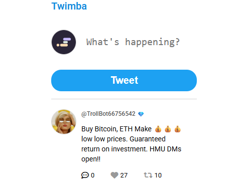

# Project: Twitter Clone (Twimba)

## Description
This project was created as part of the *Frontend Developer Career Path* on Scrimba.  
It is a simplified Twitter clone that allows users to like, retweet, and reply to posts.  
Tweets are stored in a JavaScript data file and rendered dynamically to the page.

---

## Features
- Display a feed of tweets
- Like and unlike tweets
- Retweet and un-retweet tweets
- Reply to tweets
- Real-time UI updates with JavaScript
- Responsive layout

---

## Technologies Used
- HTML5  
- CSS3 (Flexbox + responsive styling)  
- JavaScript (DOM manipulation, event listeners, conditional rendering)

---

## Project Structure
project-twitter-clone/
├── index.html
├── index.css
├── index.js
├── data.js
└── images/
├── troll.jpg
├── musk.png
├── chucknorris.jpeg
├── tcruise.png
├── flower.png
├── love.png
├── overflow.png
├── scrimbalogo.png
├── preview.png ← screenshot

---

## Screenshot

---

## Demo
GitHub Pages: 

---

## Author
Caterina De Ambrosis  
Frontend Developer Student – Aulab & Scrimba  
GitHub: https://github.com/CaterinaDA
